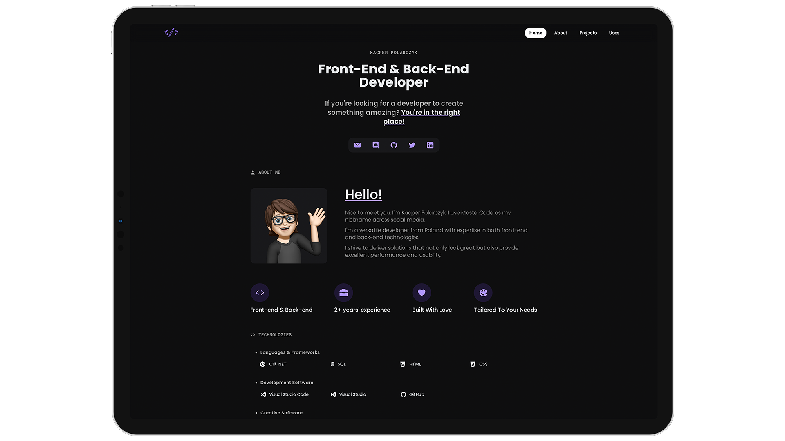

# Portfolio - Kacper Polarczyk

  

<!-- ABOUT THE PROJECT -->

## Introducion

Welcome to my GitHub repository. On my website, you will find information about me, my projects, the technologies I use, and even what I listen to daily. The website contains links to my social media profiles, certifications, and showcases my Front-end & Back-end work.

**[Visit my website](https://kacperpolarczyk.tech)**

### Features 

💻 Modern UI design\
📱 Fully Responsive\
🌐 Multi-Page Layout\
⚡️ Valid HTML5 & CSS3
  
## 🛠️ Technologies used

━ HTML\
━ CSS \
━ JavaScript \
━ **[Ionicons](https://ionic.io/ionicons)** - Open source icons

#### Fonts: Poppins and Roboto Mono

Project Version: 2.0
